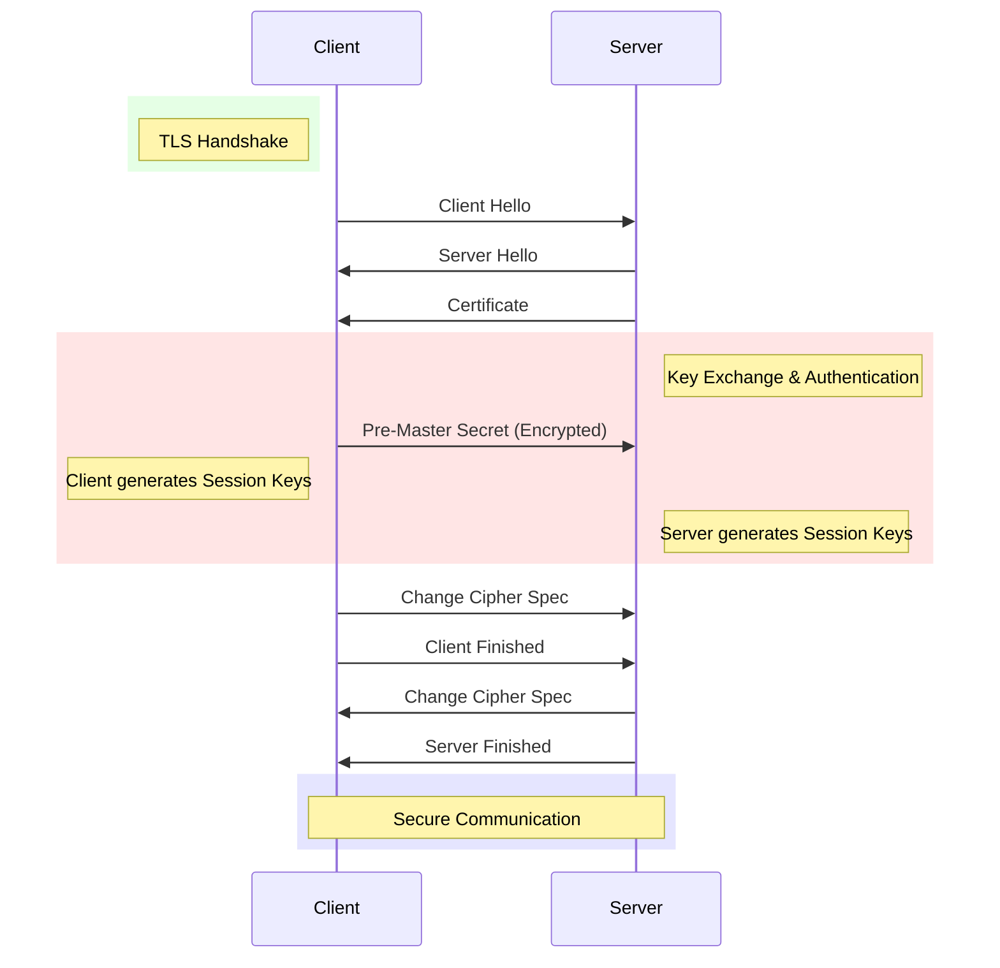

## Explain the TLS Handshake

Sure, I can describe the TLS handshake process visually.The TLS handshake is a protocol that occurs at the beginning of a secure communication session over the internet, such as when you access a website using HTTPS. It establishes a secure connection between a client (like a web browser) and a server (like a website's server) to ensure that data exchanged between them is encrypted and secure.
#### Here's a graphical representation of the TLS handshake process:

1. **Client Hello:**
   - The client (e.g., a web browser) initiates the TLS handshake by sending a "Client Hello" message to the server.
   - This message includes information like supported TLS versions, cipher suites, and other parameters.

2. **Server Hello:**
   - Upon receiving the "Client Hello," the server responds with a "Server Hello" message.
   - The server selects the highest TLS version and cipher suite that both the client and server support.

3. **Certificate Exchange:**
   - After the "Server Hello," the server sends its digital certificate to the client.
   - The certificate contains the server's public key, which the client will use to establish an encrypted connection.

4. **Key Exchange and Authentication:**
   - Next, the client verifies the server's certificate and may perform additional authentication steps, depending on the configuration.
   - The client generates a pre-master secret, encrypts it with the server's public key, and sends it to the server.

5. **Session Key Generation:**
   - Both the client and server use the pre-master secret to independently generate the session keys (encryption keys, MAC keys, and initialization vectors) for the secure communication session.

1. **Cipher Suite Confirmation:**
   - The client sends a "Change Cipher Spec" message to inform the server that subsequent messages will be encrypted with the negotiated session keys.
   - It also sends a "Client Finished" message to confirm the cipher suite selection.

2. **Server Confirmation:**
   - The server responds with its own "Change Cipher Spec" message and a "Server Finished" message to confirm the cipher suite and finalize the handshake.

3. **Secure Communication:**
   - Once both sides have confirmed the cipher suite and exchanged "Finished" messages, the TLS handshake is complete.
   - The client and server can now communicate securely using the agreed-upon encryption parameters.

This graphical representation shows the sequential steps involved in a typical TLS handshake. Each step plays a crucial role in establishing a secure and encrypted connection between the client and server, ensuring confidentiality, integrity, and authenticity of the data exchanged during the session.

---
## What is a Cipher Suite?

A cipher suite is a set of cryptographic algorithms and protocols used in the Transport Layer Security (TLS) and Secure Sockets Layer (SSL) protocols to establish secure communication channels over the internet. It defines the encryption, authentication, and key exchange mechanisms that determine how data is secured during transmission between a client (such as a web browser) and a server (such as a website's server).

A typical cipher suite includes the following components:

1. **Key Exchange Algorithm:** This algorithm is used to securely exchange encryption keys between the client and server. Examples include RSA (Rivest-Shamir-Adleman), Diffie-Hellman (DH), and Elliptic Curve Diffie-Hellman (ECDH).

2. **Authentication Algorithm:** This algorithm verifies the identity of the parties involved in the communication. It ensures that the server is legitimate and that the client is communicating with the intended server. Common authentication algorithms include RSA, Digital Signature Algorithm (DSA), and Elliptic Curve Digital Signature Algorithm (ECDSA).

3. **Cipher Algorithm:** This algorithm is used for encrypting and decrypting data. It ensures that data transmitted over the network remains confidential. Examples of cipher algorithms include Advanced Encryption Standard (AES), Triple DES (3DES), and ChaCha20.

4. **Message Authentication Code (MAC) Algorithm:** This algorithm generates a MAC, which is a cryptographic checksum used to verify the integrity of the data. It ensures that data has not been tampered with during transmission. Common MAC algorithms include HMAC (Hash-based Message Authentication Code) with various hash functions like SHA-256.

5. **Protocol Version:** The cipher suite also specifies the version of the TLS or SSL protocol being used, such as TLS 1.2 or TLS 1.3.

For example, a commonly used cipher suite might be "TLS_RSA_WITH_AES_256_CBC_SHA256," which indicates that the RSA algorithm is used for key exchange and authentication, AES with a 256-bit key is used for encryption, CBC mode is used for block cipher operation, and SHA-256 is used for message authentication.

It's important to note that the strength and security of a cipher suite depend on the specific algorithms and key sizes used within it. As cryptographic techniques evolve and vulnerabilities are discovered, newer cipher suites with stronger algorithms and improved security features are introduced to replace older, less secure ones.

---
## Links

- Beautiful and simple explanation of the need for and the methodology behind TLS.

---

- The heart of TLS.

---